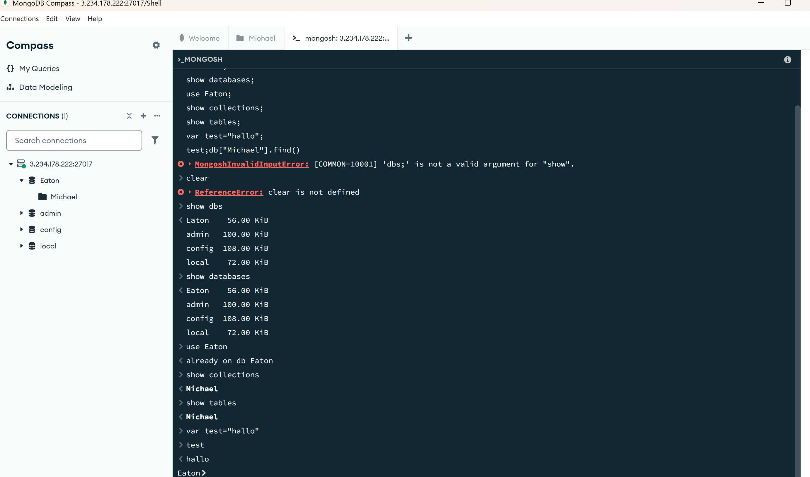
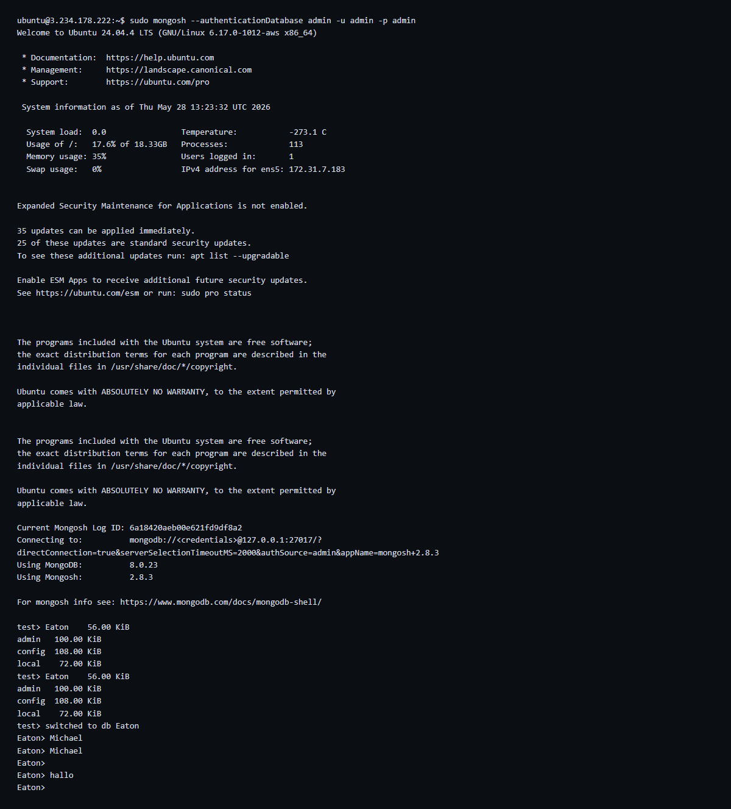

# KN01 - Aufgabe C: Erste Schritte Shell

## Schritt 1: Compass Mongosh Shell

Hier habe ich die MongoDB-Shell direkt in Compass benutzt. Ich kann damit Befehle testen, ohne ein Terminal zu oeffnen. Auf dem Screenshot sieht man, dass ich alle geforderten Befehle eingegeben habe und die Ergebnisse darunter angezeigt werden.

## Schritt 2: MongoDB Shell auf Linux Server

Ich habe dieselben Befehle direkt auf dem Server ausgefuehrt. So sieht man, dass es in der Shell auf dem Server genau gleich funktioniert wie in Compass. Das ist praktisch, wenn man keinen Zugriff auf die GUI hat.

## Schritt 3: Erklaerung der Befehle
show dbs / show databases: Zeigen alle Datenbanken auf dem Server. Beide Befehle bedeuten das Gleiche.

use [Name]: Wechselt in die angegebene Datenbank. Danach beziehen sich alle Befehle auf diese Datenbank.

show collections: Zeigt alle Collections der aktuellen Datenbank.

show tables: Alias fuer show collections. Der Befehl ist fuer Menschen gedacht, die aus SQL kommen.

Unterschied Collections vs Tables: Eine Tabelle in SQL hat fixe Spalten und Datentypen. Jede Zeile muss genau passen. Eine Collection in MongoDB ist flexibler, jedes Dokument kann andere Felder haben. Deshalb ist show tables hier nur ein anderer Name, aber keine eigene Funktion.

Die letzten zwei Befehle zeigen, dass ich in mongosh auch einfache JavaScript-Befehle ausfuehren kann. Das passt, weil JSON aus der JavaScript-Welt kommt.

## Begriffe kurz erklaert
Shell: Eine Kommandozeile, in der ich Befehle direkt an die Datenbank sende.
GUI: Eine grafische Oberflaeche wie Compass, also klicken statt tippen.
Kontext: Die aktuell aktive Datenbank, auf die sich die Befehle beziehen.
