# KN01 - Gesamtdokumentation

## Aufgabe A: Installation

### Schritt 1: Cloud-Init Datei
```yaml
#cloud-config
users:
  - name: ubuntu
    sudo: ALL=(ALL) NOPASSWD:ALL
    groups: users, admin
    home: /home/ubuntu
    shell: /bin/bash
    ssh_authorized_keys:
      - ssh-ed25519 AAAAC3NzaC1lZDI1NTE5AAAAIKCuWX/W66sjjNiDNuPpKgYO1xFqDoMJoeo5hz2LDNrF teacher-key-wir
ssh_pwauth: false
disable_root: false
package_update: true
packages:
  - unzip
  - gnupg
  - curl
write_files:
  - path: /home/ubuntu/mongodconfupdate.sh
    content: |
      sudo sed -i 's/#security:/security:\n  authorization: enabled/g' /etc/mongod.conf
  - path: /home/ubuntu/mongodbuser.txt
    content: |
      use admin;
      db.createUser(
        {
          user: "admin",
          pwd: "admin",
          roles: [
            { role: "userAdminAnyDatabase", db: "admin" },
            { role: "readWriteAnyDatabase", db: "admin" }
          ]
        }
      );
runcmd:
  - curl -fsSL https://pgp.mongodb.com/server-8.0.asc | sudo gpg -o /usr/share/keyrings/mongodb-server-8.0.gpg --dearmor
  - echo "deb [ arch=amd64,arm64 signed-by=/usr/share/keyrings/mongodb-server-8.0.gpg ] https://repo.mongodb.org/apt/ubuntu noble/mongodb-org/8.0 multiverse" | sudo tee /etc/apt/sources.list.d/mongodb-org-8.0.list
  - sudo apt-get update -y
  - sudo apt-get install -y mongodb-org
  - sudo sed -i 's/127.0.0.1/0.0.0.0/g' /etc/mongod.conf
  - sudo chmod +x /home/ubuntu/mongodconfupdate.sh
  - sudo /home/ubuntu/mongodconfupdate.sh
  - sudo systemctl enable mongod
  - sudo systemctl start mongod
  - sudo sleep 3
  - sudo mongosh < /home/ubuntu/mongodbuser.txt
  - sudo systemctl restart mongod
```
Ich nutze Cloud-Init, damit der Server beim ersten Start automatisch eingerichtet wird. Das Skript legt den Benutzer an, installiert MongoDB, oeffnet die Verbindung nach aussen und erstellt den Admin-User. So muss ich die Schritte nicht von Hand tippen und habe spaeter immer die gleiche, reproduzierbare Installation.

### Schritt 2: Screenshot Compass Datenbanken
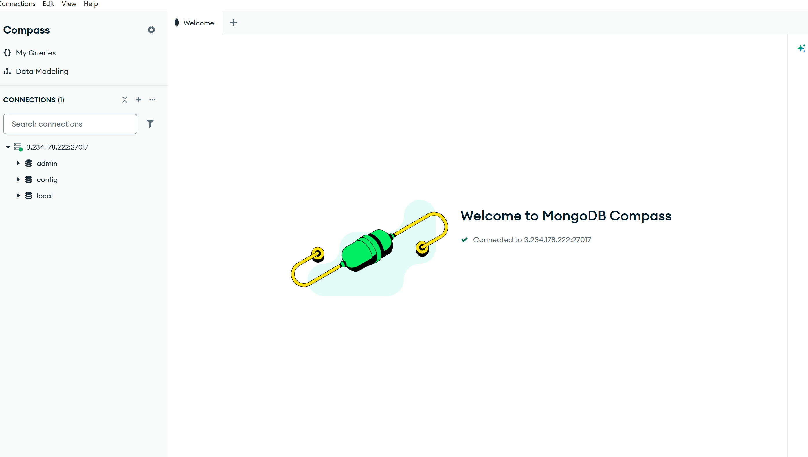
Auf dem Screenshot sehe ich die Standard-Datenbanken admin, config und local. Das zeigt mir, dass der Server erreichbar ist und Compass die Verbindung aufgebaut hat. admin wird fuer Benutzer und Rechte genutzt, config speichert interne Einstellungen, und local enthaelt lokale Informationen wie z.B. Replikationsdaten.

### Schritt 3: Erklaerung authSource=admin
authSource sagt MongoDB, in welcher Datenbank die Zugangsdaten gesucht werden. Ich melde mich mit dem Benutzer admin an, und dieser Benutzer wurde in der Datenbank admin erstellt. Deshalb muss authSource=admin gesetzt sein. Wenn ich authSource=local nehme, sucht MongoDB im falschen Ort und lehnt die Anmeldung ab.

### Schritt 4: Erklaerung der sed Befehle
Befehl 1: sudo sed -i 's/127.0.0.1/0.0.0.0/g' /etc/mongod.conf
Ich aendere bindIp von 127.0.0.1 auf 0.0.0.0. 127.0.0.1 bedeutet nur lokale Verbindungen. 0.0.0.0 bedeutet, dass MongoDB auf allen Netzwerkadressen hoert und Compass von aussen zugreifen darf.

Befehl 2: sudo sed -i 's/#security:/security:\n  authorization: enabled/g' /etc/mongod.conf
Hier schalte ich die Anmeldung ein. Ohne authorization: enabled koennte jeder ohne Passwort zugreifen. Mit der Einstellung ist ein Login mit Benutzername und Passwort Pflicht.

### Schritt 5: Screenshot mongod.conf
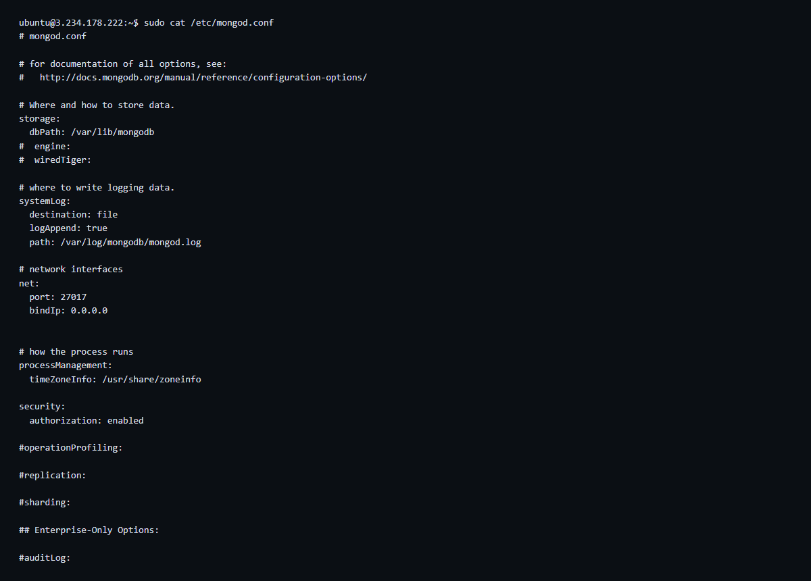
Der Screenshot beweist, dass die beiden wichtigen Einstellungen aktiv sind: bindIp steht auf 0.0.0.0 und authorization steht auf enabled. Damit ist der Server von aussen erreichbar und gleichzeitig abgesichert.

### Begriffe kurz erklaert (Aufgabe A)
Cloud-Init: Ein Startskript fuer Cloud-Server, das beim ersten Booten automatisch laeuft.
YAML: Ein einfaches Textformat, das wie eingerueckte Listen aussieht und gut lesbar ist.
mongod: Der eigentliche Datenbankdienst, also der Serverprozess von MongoDB.
mongosh: Die Kommandozeile, mit der ich Befehle an MongoDB schicke.
bindIp: Steuert, auf welchen Netzwerkadressen der Server Verbindungen annimmt.
authSource: Die Datenbank, in der MongoDB den Benutzer und das Passwort nachschlaegt.
Role: Eine Rolle ist ein Paket von Rechten, z.B. nur lesen oder lesen und schreiben.
Replica Set: Eine Gruppe von MongoDB-Servern, die sich gegenseitig kopieren, damit bei Ausfall ein anderer uebernimmt.

## Aufgabe B: Erste Schritte GUI

### Schritt 1: Dokument vor dem Einfuegen
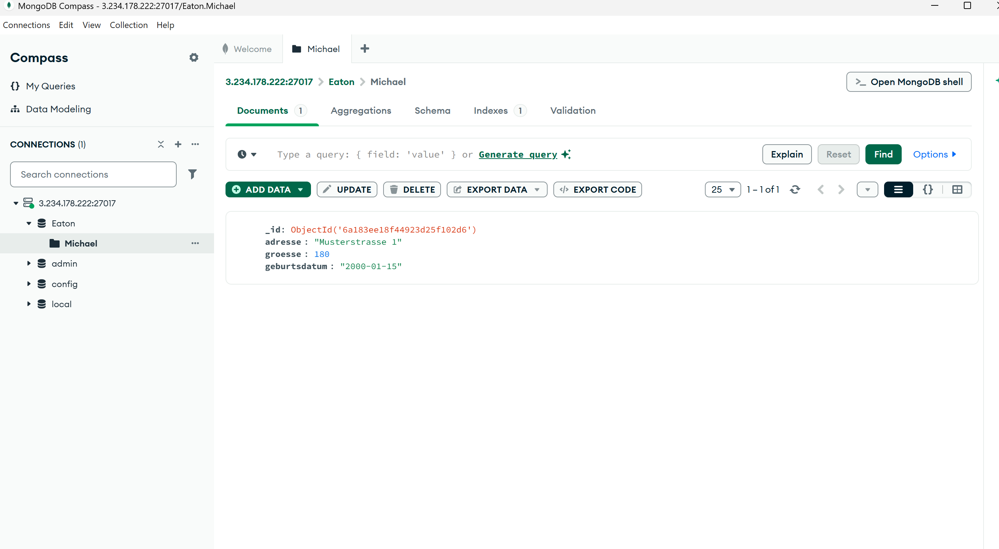
Ich lege eine neue Datenbank und eine Collection an und tippe ein Beispiel-Dokument ein, druecke aber noch nicht auf Insert. Das ist der Moment, in dem man gut sieht, welche Felder ich erfasse und wie die Werte zuerst als normale Strings und Zahlen erfasst werden.

### Schritt 2: Compass nach Datumstypanpassung
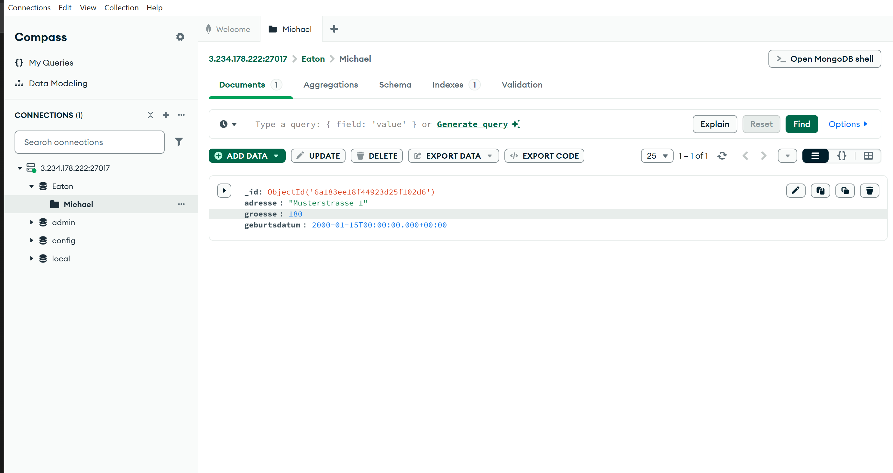
Nach dem Einfuegen oeffne ich das Dokument und aendere den Typ von geburtsdatum auf Date. So speichert MongoDB das Datum als echten Datumstyp und nicht als Text. Ich sehe Datenbank, Collection und Dokument, also den gesamten Weg vom Container bis zum einzelnen Datensatz.

### Schritt 3: Export JSON
```json
[{"_id":{"$oid":"6a183ee18f44923d25f102d6"},"adresse":"Musterstrasse 1","groesse":180,"geburtsdatum":{"$date":"2000-01-15T00:00:00.000Z"}}]
```
Der Export zeigt, wie MongoDB das Datum speichert: nicht als reinen String, sondern als spezielles $date Feld. Ausserdem sehe ich die _id, die MongoDB automatisch vergibt. Das ist die eindeutige ID des Dokuments.

### Schritt 4: Erklaerung Datumstyp
Wenn ich ein Datum direkt korrekt einfuegen will, nutze ich MongoDB Extended JSON:
{ "geburtsdatum": { "$date": "2000-01-15T00:00:00.000Z" } }

JSON kennt nur String, Number, Boolean, Array, Object und null. Ein Datum als String bleibt deshalb ein String. Extended JSON erweitert das mit speziellen Schluesseln wie $date und sagt damit klar, welcher Typ gemeint ist.

Dasselbe Thema gibt es bei Integer vs Double, ObjectId und Timestamp. Ohne Extended JSON muss ich die Typen nachtraeglich in Compass korrigieren.

### Begriffe kurz erklaert (Aufgabe B)
Datenbank: Ein Container fuer Collections.
Collection: Eine Sammlung von Dokumenten, vergleichbar mit einer Tabelle, aber ohne fixes Schema.
Dokument: Ein einzelner Datensatz im JSON-Format.
Feld: Ein einzelner Wert im Dokument, z.B. adresse oder geburtsdatum.
ObjectId: Eine automatisch erzeugte eindeutige ID fuer jedes Dokument.

## Aufgabe C: Erste Schritte Shell

### Schritt 1: Compass Mongosh Shell

Hier habe ich die MongoDB-Shell direkt in Compass benutzt. Ich kann damit Befehle testen, ohne ein Terminal zu oeffnen. Auf dem Screenshot sieht man, dass ich alle geforderten Befehle eingegeben habe und die Ergebnisse darunter angezeigt werden.

### Schritt 2: MongoDB Shell auf Linux Server

Ich habe dieselben Befehle direkt auf dem Server ausgefuehrt. So sieht man, dass es in der Shell auf dem Server genau gleich funktioniert wie in Compass. Das ist praktisch, wenn man keinen Zugriff auf die GUI hat.

### Schritt 3: Erklaerung der Befehle
show dbs / show databases: Zeigen alle Datenbanken auf dem Server. Beide Befehle bedeuten das Gleiche.

use [Name]: Wechselt in die angegebene Datenbank. Danach beziehen sich alle Befehle auf diese Datenbank.

show collections: Zeigt alle Collections der aktuellen Datenbank.

show tables: Alias fuer show collections. Der Befehl ist fuer Menschen gedacht, die aus SQL kommen.

Unterschied Collections vs Tables: Eine Tabelle in SQL hat fixe Spalten und Datentypen. Jede Zeile muss genau passen. Eine Collection in MongoDB ist flexibler, jedes Dokument kann andere Felder haben. Deshalb ist show tables hier nur ein anderer Name, aber keine eigene Funktion.

Die letzten zwei Befehle zeigen, dass ich in mongosh auch einfache JavaScript-Befehle ausfuehren kann. Das passt, weil JSON aus der JavaScript-Welt kommt.

### Begriffe kurz erklaert (Aufgabe C)
Shell: Eine Kommandozeile, in der ich Befehle direkt an die Datenbank sende.
GUI: Eine grafische Oberflaeche wie Compass, also klicken statt tippen.
Kontext: Die aktuell aktive Datenbank, auf die sich die Befehle beziehen.

## Aufgabe D: Rechte und Rollen

### Schritt 1: Falscher authSource Fehler
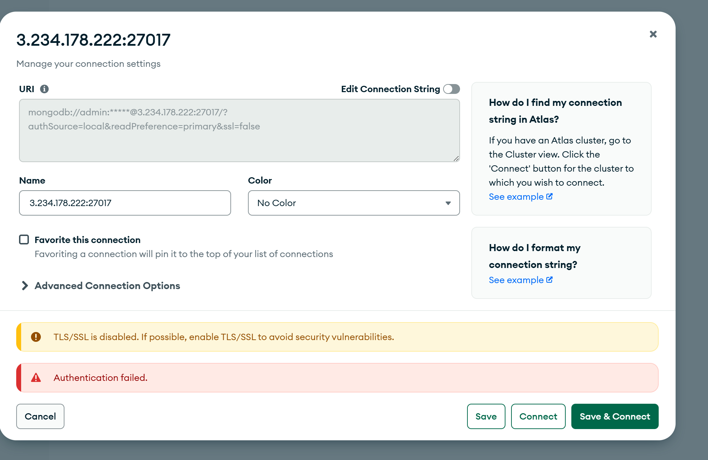
Ich habe absichtlich authSource=local verwendet. Dadurch sucht MongoDB den Benutzer in der falschen Datenbank und die Anmeldung scheitert. Das zeigt, wie wichtig der richtige authSource ist.

### Schritt 2: Benutzer Skript
```javascript
use Eaton;
db.createUser({
  user: "leser",
  pwd: "LeserPass.1",
  roles: [{ role: "read", db: "Eaton" }]
});
use admin;
db.createUser({
  user: "schreiber",
  pwd: "SchreiberPass.1",
  roles: [{ role: "readWrite", db: "Eaton" }]
});
```
Mit dem Skript erstelle ich zwei Benutzer mit unterschiedlichen Rechten. leser darf nur lesen, schreiber darf lesen und schreiben. So kann ich die Wirkung von Rollen direkt zeigen.

### Schritt 3: Benutzer 1 - Nur Lesen
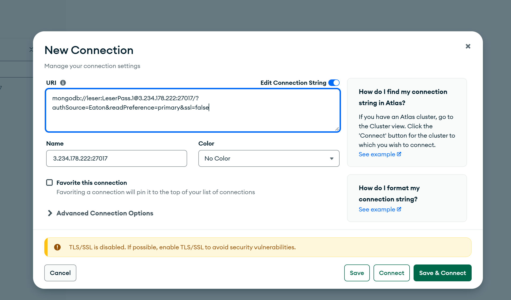
Hier sieht man, dass der Benutzer leser sich anmelden kann.

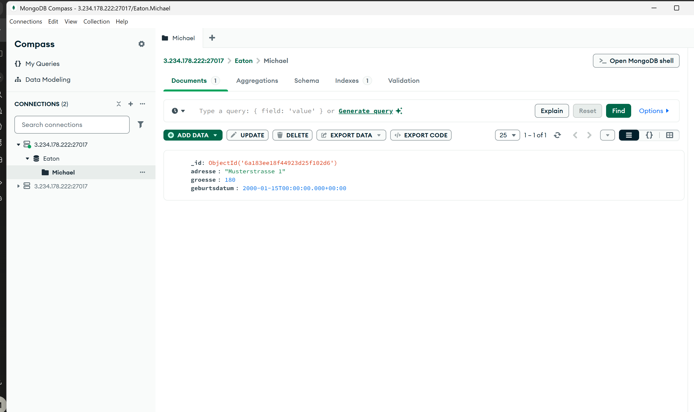
Der Benutzer leser kann die Dokumente sehen, also lesen.

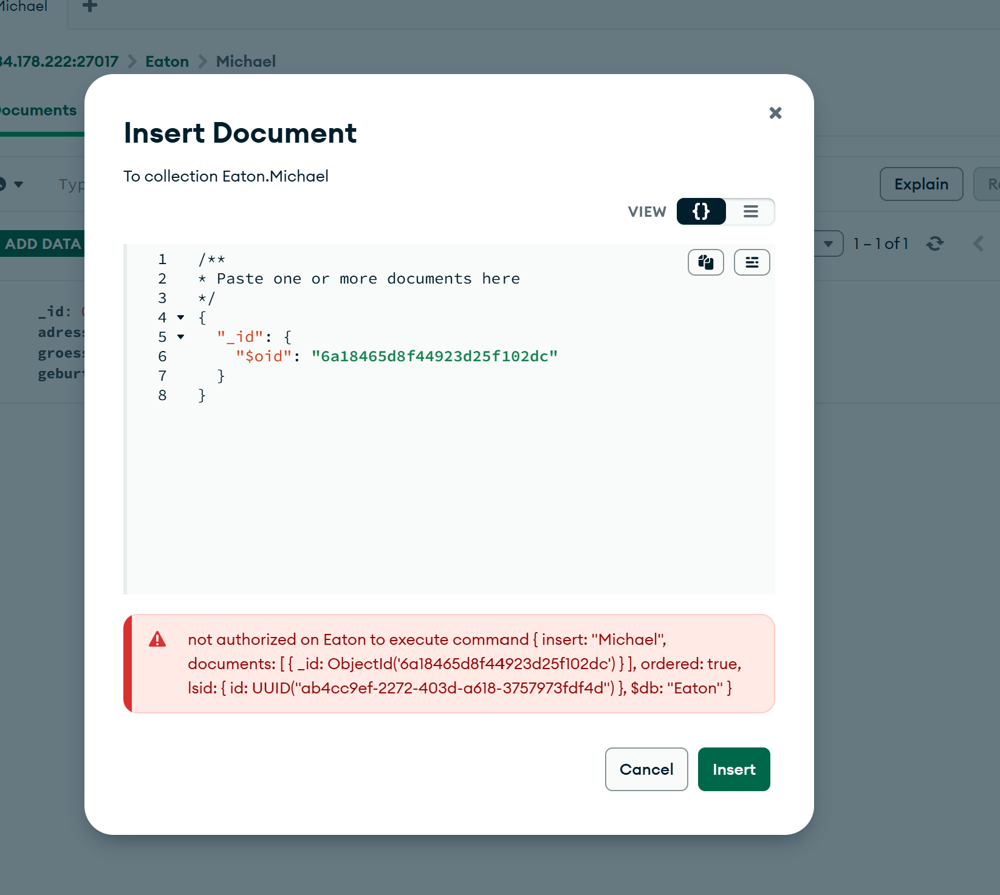
Beim Einfuegen kommt ein Fehler, weil leser keine Schreibrechte hat. Das ist genau der Sinn der read Rolle.

### Schritt 4: Benutzer 2 - Lesen und Schreiben
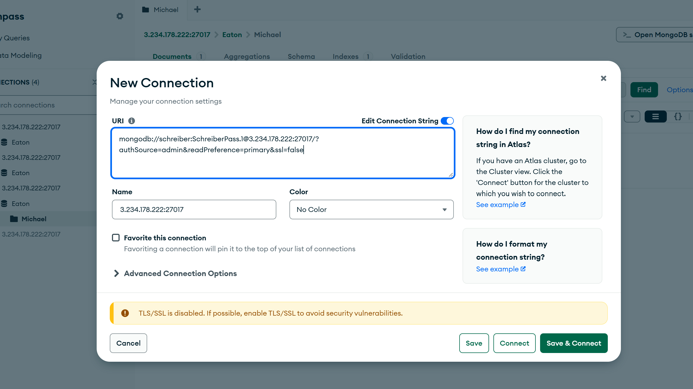
Hier sieht man die Anmeldung mit schreiber.

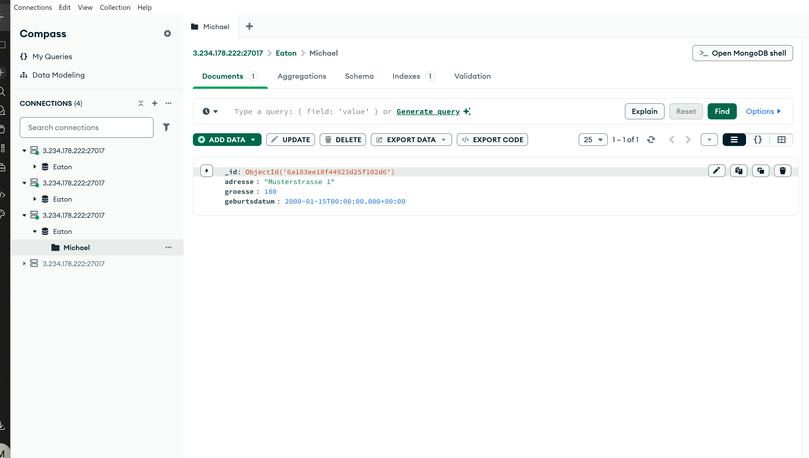
Der Benutzer schreiber kann die Daten lesen.

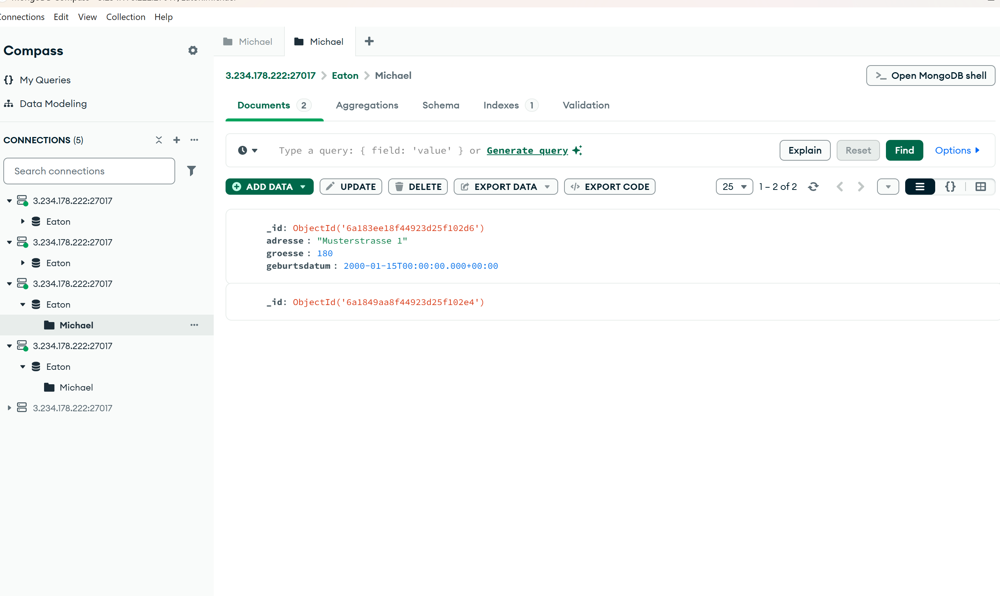
Das Einfuegen klappt, weil schreiber die readWrite Rolle hat.

### Begriffe kurz erklaert (Aufgabe D)
Role: Eine Rolle ist ein Paket von Rechten. read erlaubt nur lesen, readWrite erlaubt lesen und schreiben.
authSource: Die Datenbank, in der MongoDB den Benutzer und das Passwort nachschlaegt.
Rechte: Regeln, was ein Benutzer in der Datenbank tun darf.
Benutzer: Ein Login fuer die Datenbank mit Namen und Passwort.
